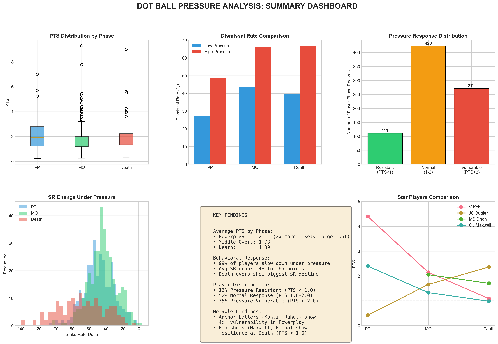
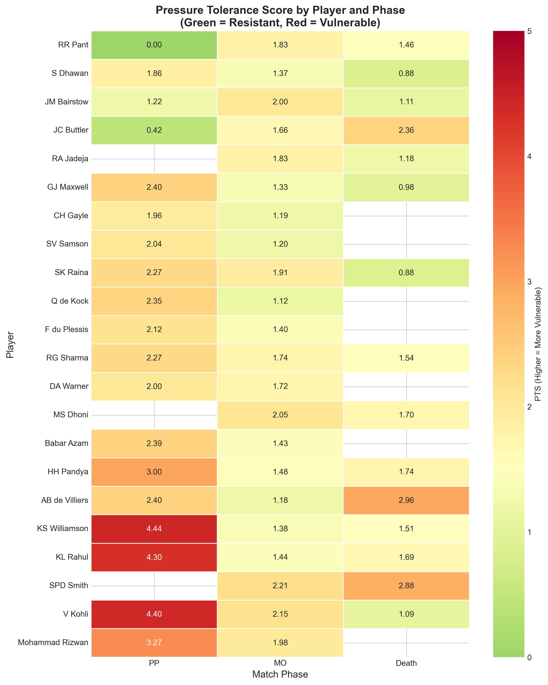
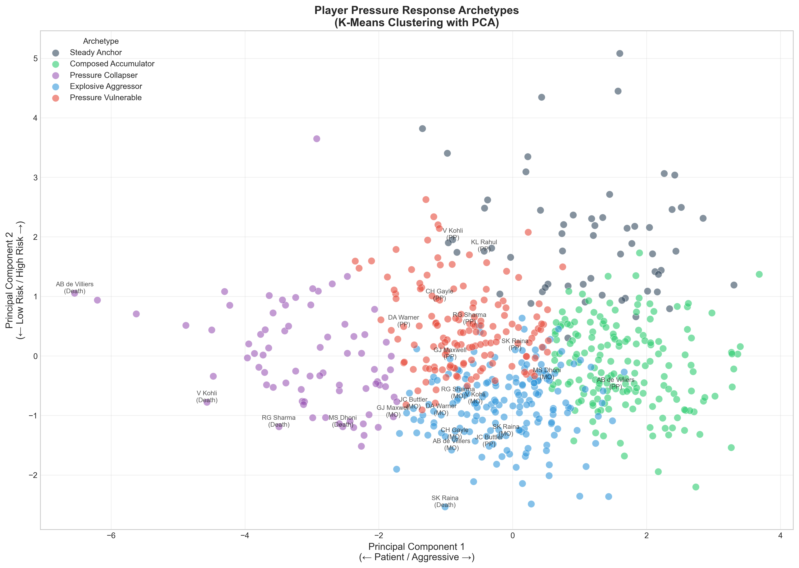
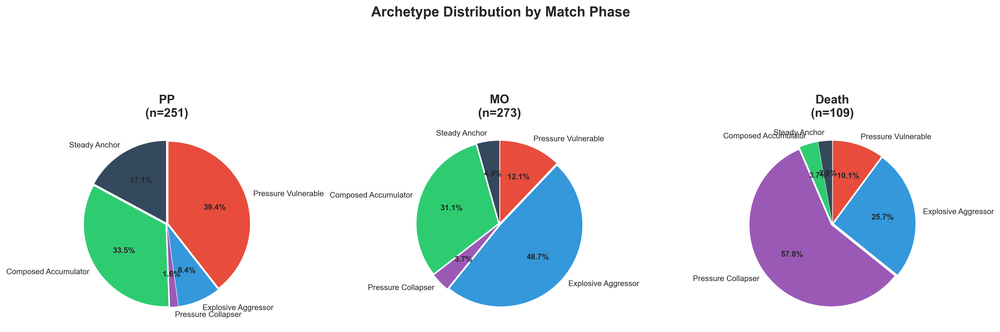

# DOT Pressure Analysis

## Quantifying How T20 Batsmen Respond to Dot Ball Pressure

[](https://www.python.org/downloads/)
[](https://streamlit.io/)
[](LICENSE)

An advanced cricket analytics project that investigates how dot ball pressure affects batsmen's dismissal probability and behavioral response across different match phases in T20 cricket. Features a novel **Pressure Tolerance Score (PTS)** metric and player archetype classification system.



---

## Table of Contents

- [Overview](#overview)
- [Key Findings](#key-findings)
- [Methodology](#methodology)
- [Installation](#installation)
- [Usage](#usage)
- [Project Structure](#project-structure)
- [Data Pipeline](#data-pipeline)
- [Metrics Explained](#metrics-explained)
- [Visualizations](#visualizations)
- [Interactive Dashboard](#interactive-dashboard)
- [Future Work](#future-work)
- [Contributing](#contributing)
- [License](#license)

---

## Overview

### The Problem

In T20 cricket, dot balls (deliveries where no runs are scored) create mounting pressure on batsmen. But how significant is this pressure effect? Does it vary by match phase? And do different players respond differently?

### The Solution

This project develops a comprehensive analytical framework to:

1. **Quantify pressure** using phase-specific dot density thresholds
2. **Measure response** via the Pressure Tolerance Score (PTS)
3. **Classify players** into distinct pressure-response archetypes
4. **Visualize insights** through an interactive Streamlit dashboard

### Dataset

- **1.5M+ deliveries** across 5,400+ T20 matches
- **Sources**: IPL, T20 Internationals, Big Bash League (BBL)
- **Data Provider**: [Cricsheet](https://cricsheet.org/)

---

## Key Findings

### 1. Pressure Significantly Increases Dismissal Risk

| Match Phase | Average PTS | Interpretation |
|-------------|-------------|----------------|
| Powerplay | 2.11 | **2x more likely** to get out under pressure |
| Middle Overs | 1.73 | 1.7x more likely |
| Death Overs | 1.89 | 1.9x more likely |

### 2. Universal Behavioral Response

- **99% of players slow down** under dot ball pressure
- Average strike rate drop: **48-65 points** depending on phase
- Death overs show the **biggest SR decline** (-65 on average)

### 3. Player Distribution

| Category | Percentage | Description |
|----------|------------|-------------|
| Pressure Resistant | 13% | PTS < 1.0 — thrives under pressure |
| Normal Response | 52% | PTS 1.0-2.0 — expected increase in risk |
| Pressure Vulnerable | 35% | PTS > 2.0 — significantly struggles |

### 4. Star Player Insights

| Player | PP PTS | MO PTS | Death PTS | Profile |
|--------|--------|--------|-----------|---------|
| V Kohli | 4.40 (Vulnerable) | 2.15 | 1.09 | Anchor - struggles early, steadies at death |
| JC Buttler | 0.42 (Resistant) | 1.66 | 2.36 | Elite PP opener, vulnerable at death |
| MS Dhoni | - | 2.05 | 1.70 | The Finisher - consistent under pressure |
| GJ Maxwell | 2.40 | 1.33 | 0.98 (Resistant) | Death specialist |

### 5. Five Distinct Archetypes Identified

| Archetype | Players | Characteristics |
|-----------|---------|-----------------|
| Composed Accumulator | 173 | Patient, survives pressure, low SR |
| Explosive Aggressor | 182 | High SR, attacks regardless of situation |
| Pressure Collapser | 77 | High SR normally, biggest drop under pressure |
| Pressure Vulnerable | 143 | High dismissal risk + significant SR drop |
| Steady Anchor | 58 | Consistent but struggles under pressure |

---

## Methodology

### Phase-Specific Dot Density Thresholds

Rather than using a single threshold, we calculate the 75th percentile of dot density for each phase:

| Phase | Threshold | Rationale |
|-------|-----------|-----------|
| Powerplay (Overs 1-6) | 57% | Higher tolerance early in innings |
| Middle Overs (7-15) | 45% | Moderate threshold |
| Death Overs (16-20) | 40% | Lower bar — any dots at death are costly |

### Pressure Tolerance Score (PTS)

```
PTS = Dismissal Rate (High Pressure) / Dismissal Rate (Low Pressure)
```

**Interpretation:**
- **PTS = 1.0**: No pressure effect
- **PTS < 1.0**: Pressure resistant (rare)
- **PTS > 2.0**: Highly pressure vulnerable

### Minimum Sample Requirements

| Criterion | Threshold |
|-----------|-----------|
| Balls faced per phase | PP: ≥10, MO: ≥10, Death: ≥5 |
| Total innings per phase | ≥10 |
| High-pressure innings | ≥5 |
| Low-pressure innings | ≥5 |

---

## Installation

### Prerequisites

- Python 3.9 or higher
- pip package manager

### Setup

1. **Clone the repository**
```bash
git clone https://github.com/yourusername/DOT_Pressure_Analysis.git
cd DOT_Pressure_Analysis
```

2. **Create virtual environment** (recommended)
```bash
python -m venv .venv
source .venv/bin/activate  # On Windows: .venv\Scripts\activate
```

3. **Install dependencies**
```bash
pip install -r requirements.txt
```

4. **Download raw data** from [Cricsheet](https://cricsheet.org/downloads/)
   - Place IPL JSON files in `data/raw/ipl/`
   - Place T20I JSON files in `data/raw/t20i/`
   - Place BBL JSON files in `data/raw/bbl/`

---

## Usage

### Option 1: Run the Complete Pipeline

```bash
# Step 1: Parse raw JSON data
python src/data_parser.py

# Step 2: Engineer features
python src/feature_engineering.py

# Step 3: Create player-phase aggregations
python src/Phasewise_pressure_analysis.py

# Step 4: Calculate PTS metrics
python src/pressure_tolerance_score.py

# Step 5: Run archetype clustering
python src/archetype_clustering_refined.py

# Step 6: Generate visualizations
python src/pressure_analysis_visuals.py
```

### Option 2: Launch Interactive Dashboard

```bash
streamlit run src/streamlit_player_lookup.py
```

The dashboard will open in your browser at `http://localhost:8501`

---

## Project Structure

```
DOT_Pressure_Analysis/
|
|-- data/
|   |-- raw/                          # Raw JSON files from Cricsheet
|   |   |-- ipl/
|   |   |-- t20i/
|   |   |-- bbl/
|   |-- processed/                    # Generated CSV files
|       |-- raw_ballbyball_data.csv
|       |-- analysis_ready_data.csv
|       |-- player_phase_innings.csv
|       |-- player_pressure_metrics.csv
|       |-- player_archetypes.csv
|
|-- src/
|   |-- data_parser.py                # JSON to CSV conversion
|   |-- feature_engineering.py        # Feature creation
|   |-- Phasewise_pressure_analysis.py # Aggregation logic
|   |-- pressure_tolerance_score.py   # PTS calculation
|   |-- archetype_clustering_refined.py # K-means clustering
|   |-- pressure_analysis_visuals.py  # Visualization generation
|   |-- streamlit_player_lookup.py    # Interactive dashboard
|
|-- results/
|   |-- pressure_analysis_visuals/    # Generated PNG charts
|       |-- 01_pts_distribution_by_phase.png
|       |-- 02_sr_delta_vs_pts.png
|       |-- 03_star_players_heatmap.png
|       |-- ...
|       |-- 14_archetype_summary_table.png
|
|-- notebooks/                        # Jupyter notebooks for exploration
|
|-- .gitignore
|-- README.md
|-- requirements.txt
|-- LICENSE
```

---

## Data Pipeline

```
┌─────────────────────┐
│  Raw JSON Files     │
│  (Cricsheet)        │
└──────────┬──────────┘
           │
           ▼
┌─────────────────────┐
│  data_parser.py     │
│  • Parse deliveries │
│  • Extract metadata │
└──────────┬──────────┘
           │
           ▼
┌─────────────────────┐
│ raw_ballbyball.csv  │
│ 1.5M+ deliveries    │
└──────────┬──────────┘
           │
           ▼
┌─────────────────────┐
│ feature_engineering │
│ • Match phase       │
│ • Consecutive dots  │
│ • Pressure dismissal│
└──────────┬──────────┘
           │
           ▼
┌─────────────────────┐
│ analysis_ready.csv  │
│ With all features   │
└──────────┬──────────┘
           │
           ▼
┌─────────────────────┐
│ Phasewise_pressure  │
│ • Aggregate by      │
│   player-phase-inn  │
│ • Calculate density │
└──────────┬──────────┘
           │
           ▼
┌─────────────────────┐
│player_phase_innings │
│ 78,937 records      │
└──────────┬──────────┘
           │
           ▼
┌─────────────────────┐
│ pressure_tolerance  │
│ • PTS calculation   │
│ • SR/Boundary delta │
└──────────┬──────────┘
           │
           ▼
┌─────────────────────┐
│pressure_metrics.csv │
│ 1,366 player-phase  │
└──────────┬──────────┘
           │
           ▼
┌─────────────────────┐
│ archetype_clustering│
│ • K-means (K=5)     │
│ • PCA visualization │
└──────────┬──────────┘
           │
           ▼
┌─────────────────────┐
│player_archetypes.csv│
│ With cluster labels │
└─────────────────────┘
```

---

## Metrics Explained

### Core Metrics

| Metric | Formula | Range | Interpretation |
|--------|---------|-------|----------------|
| **Dot Density** | Dots Faced / Balls Faced | 0-1 | Higher = more struggle |
| **PTS** | High Pressure Dism Rate / Low Pressure Dism Rate | 0-∞ | Higher = more vulnerable |
| **SR Delta** | High Pressure SR - Low Pressure SR | -∞ to +∞ | Negative = slows down |
| **Boundary Delta** | High Pressure Bndry% - Low Pressure Bndry% | -1 to +1 | Negative = less aggressive |

### PTS Categories

| Category | PTS Range | Color | Meaning |
|----------|-----------|-------|---------|
| Pressure Resistant | < 1.0 | 🟢 Green | Less likely to get out under pressure |
| Normal Response | 1.0 - 2.0 | 🟡 Yellow | Expected increase in risk |
| Pressure Vulnerable | > 2.0 | 🔴 Red | Significantly higher dismissal risk |

---

## Visualizations

### PTS Distribution by Phase


### Star Players Heatmap


### Player Pressure Profiles


### Archetype Clusters


### Archetype Distribution by Phase


---

## Interactive Dashboard

The Streamlit dashboard provides an intuitive interface for exploring player pressure profiles.

### Features

- **Player Search**: Filter and select from 900+ players
- **Phase-wise PTS Gauges**: Visual pressure tolerance indicators
- **Archetype Badges**: Color-coded player classification
- **Comparison Charts**: Player vs league average
- **Detailed Metrics Table**: All statistics at a glance
- **Auto-generated Insights**: Plain-English interpretation

### Launch

```bash
streamlit run src/streamlit_player_lookup.py
```

---

## Future Work

- [ ] **Match Context**: Include required rate, wickets remaining, target
- [ ] **Bowling Quality**: Weight by bowler economy and wicket-taking ability
- [ ] **Venue Effects**: Adjust for pitch conditions and ground size
- [ ] **Career Trajectory**: Track how player profiles evolve over time
- [ ] **Real-time Prediction**: Live dismissal probability during innings
- [ ] **Team Optimization**: Batting order recommendations based on archetypes

---

## Contributing

Contributions are welcome! Please feel free to submit a Pull Request.

1. Fork the repository
2. Create your feature branch (`git checkout -b feature/AmazingFeature`)
3. Commit your changes (`git commit -m 'Add some AmazingFeature'`)
4. Push to the branch (`git push origin feature/AmazingFeature`)
5. Open a Pull Request

---

## License

This project is licensed under the MIT License - see the [LICENSE](LICENSE) file for details.

---

## Acknowledgments

- [Cricsheet](https://cricsheet.org/) for providing open-source cricket data
- The cricket analytics community for inspiration and methodology discussions

---

## Contact

**Mandar** - [GitHub](https://github.com/21Mandar)

Project Link: [https://github.com/21Mandar/DOT_Pressure_Analysis](https://github.com/21Mandar/DOT_Pressure_Analysis)

---

Made with passion for cricket analytics